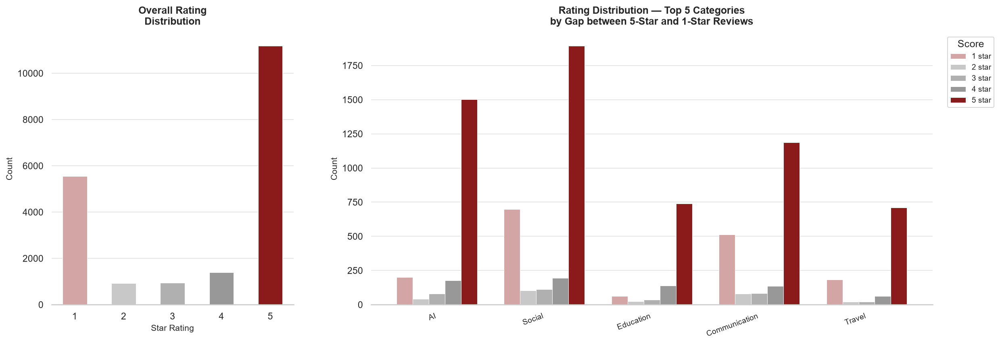
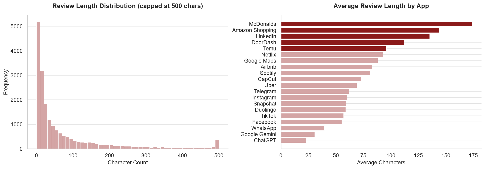
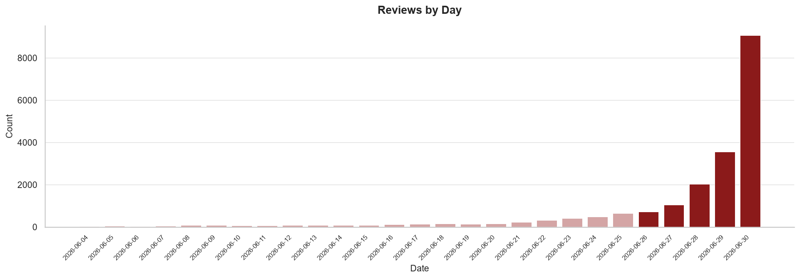
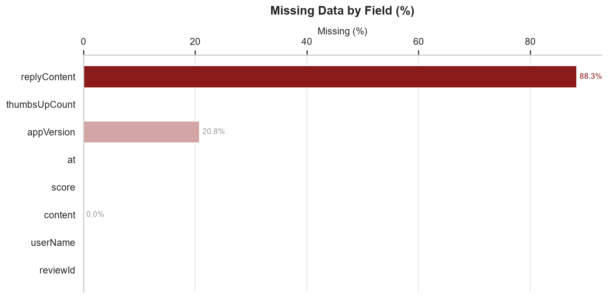
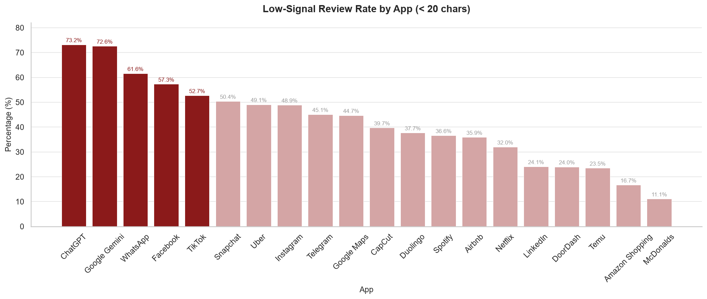
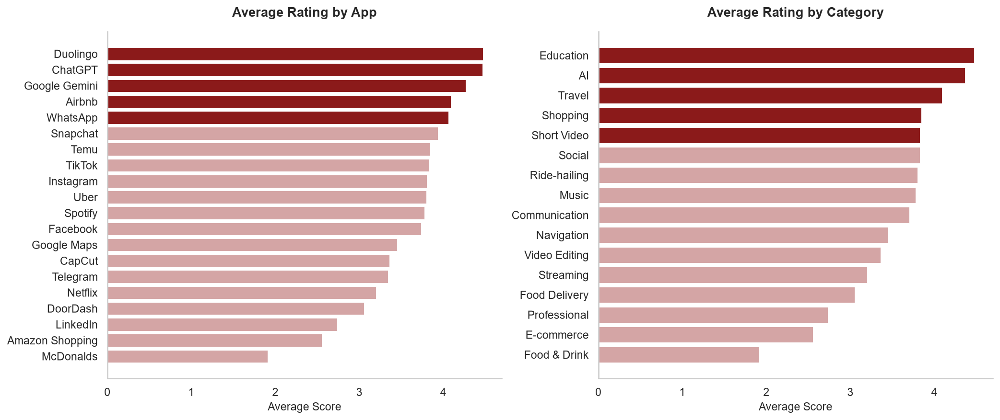

# EDA Findings — Google Play Store Reviews

**Dataset:** 20k reviews across 20 apps and 16 categories  
**Collection date:** June 2026  

---

## Overview
 
This report documents the exploratory data analysis (EDA) conducted on 20,000 Google Play Store reviews collected from 20 top-ranked apps across 16 industry categories. The goal is to assess whether the collected data is structurally sound and of sufficient quality to support downstream sentiment analysis and database design.
 
Key findings at a glance:
- Core fields (review text, rating, timestamp) are 100% complete and structurally consistent
- Rating distribution is heavily skewed toward 1-star and 5-star, reflecting polarized user behavior
- 41.8% of reviews are low-signal (under 20 characters), with significant variation across app categories
- All reviews fall within a single month (June 2026), limiting temporal depth
- 19.5% of review content is duplicated, requiring cleaning before analysis

---

## 1. Basic Overview

| Metric | Value |
|--------|-------|
| Total reviews | 20,000 |
| Total apps | 20 |
| Total categories | 16 |
| Date range | 2026.06.04 - 2026.06.30 |
| Reviews per app | 1,000 (uniform) |

---

## 2. Rating Distribution

The overall rating distribution shows a strong U-shaped pattern, with 5-star reviews dominating at **55.9%** and 1-star reviews accounting for **27.8%**. Mid-range ratings (2–4 stars) make up only **16.4%** combined.

| Star | Count | Percentage |
|------|-------|------------|
| 1 | 5,558 | 27.8% |
| 2 | 932 | 4.7% |
| 3 | 941 | 4.7% |
| 4 | 1,391 | 7.0% |
| 5 | 11,178 | 55.9% |

**Key finding:** 

The data exhibits significant positive bias. This polarized distribution is typical of app store reviews, where users tend to leave feedback only when they feel strongly. For downstream sentiment analysis, this imbalance should be accounted for during model training (e.g. via class weighting or resampling).

The right chart highlights the top 5 categories with the largest gap between 5-star and 1-star reviews. Social and AI categories show the widest polarization, suggesting users hold strong opinions about these app types.

---

## 3. Review Length

- **Mean length:** 79.6 characters
- **Median length:** 28.0 characters
- **Max length:** 500+ characters
- **Min length:** 0 characters

The large gap between mean and median indicates a right-skewed distribution — most reviews are short, but a smaller number of detailed reviews pull the average up significantly.

**App-level differences are notable:**

| App | Avg Length |
|-----|------------|
| **McDonalds** | **173.9 chars** |
| **Amazon Shopping** | **143.9 chars** |
| **LinkedIn** | **135.2 chars** |
| Google Gemini | 30.6 chars |
| ChatGPT | 22.9 chars |

Service-oriented apps (food, e-commerce, professional) tend to attract more detailed reviews, while AI and social apps receive shorter, more reactive responses.

---

## 4. Timestamp Coverage

All 20,000 reviews fall within a single month (June 2026), with a clear recency bias — the majority of reviews are concentrated in the final days of the collection period (June 28–30).

**Key finding:** This is a limitation of collecting only the most recent reviews. The dataset lacks historical depth, which may affect trend analysis. For a production pipeline, recurring collection over time would be needed to build longitudinal coverage.

---

## 5. Missing Fields

| Field | Missing | Rate |
|-------|---------|------|
| reviewId | 0 | 0.0% |
| userName | 0 | 0.0% |
| content | 3 | <0.1% |
| score | 0 | 0.0% |
| at | 0 | 0.0% |
| appVersion | 4,157 | 20.8% |
| thumbsUpCount | 0 | 0.0% |
| replyContent | 17,666 | 88.3% |

**Key findings:**
- Core fields (reviewId, userName, content, score, timestamp) are nearly 100% complete — strong signal for pipeline reliability.
- `appVersion` is missing in 20.8% of reviews, limiting version-based analysis for some apps.
- `replyContent` is missing in 88.3% of cases, reflecting low developer engagement across most apps. This field has limited utility for the current pipeline and could be treated as optional metadata.

---

## 6. Duplicate Analysis

| Type | Count |
|------|-------|
| Duplicate reviewIds | 0 |
| Duplicate content | 3,890 (19.5%) |

No duplicate review IDs were found, confirming that the collection did not pull the same review twice. However, **19.5% of review content is duplicated** — likely a combination of template reviews ("Great app!", "Works perfectly"), copy-paste reviews, and potentially coordinated fake reviews. This should be addressed during the data cleaning phase.

---

## 7. Language Analysis

- **Likely English:** 18,813 (94.1%)
- **Likely non-English:** 1,187 (5.9%)

The majority of reviews are in English, consistent with the `lang='en'` and `country='us'` parameters used during collection. However, a small proportion of non-English content still appears, likely from users who have set their device language differently.

Apps with the lowest English rates include Facebook (88.8%), Google Gemini (89.3%), and TikTok (89.5%) — all global platforms with highly international user bases. For a pipeline targeting English-language sentiment analysis, language filtering should be applied as part of data cleaning.

---

## 8. Low-Signal Reviews

Reviews with fewer than 20 characters were classified as low-signal, as they typically lack sufficient context for meaningful sentiment analysis.

- **Total low-signal reviews:** 8,369 (41.8%)

Sample low-signal reviews:
- *"Brilliant"*
- *"Good"*
- *"very good"*
- *"great service"*
- *"slow watching"*

**App-level breakdown reveals significant variation:**

- ChatGPT (73.2%) and Google Gemini (72.6%) have the highest low-signal rates — users of AI apps tend to leave brief reactive comments rather than detailed feedback.
- McDonalds (11.1%) and Amazon Shopping (16.7%) have the lowest rates — service and e-commerce users tend to write more descriptive reviews.

This finding has direct implications for downstream NLP: apps with high low-signal rates may require additional filtering or augmentation to produce reliable sentiment labels.

---

## 9. App & Category Differences

**Highest rated apps:** Duolingo (4.47), ChatGPT (4.47), Google Gemini (4.27)  
**Lowest rated apps:** McDonalds (1.91), Amazon Shopping (2.56), LinkedIn (2.73)

**By category:** Education and AI categories lead with average ratings above 4.2, while Food & Drink and E-commerce categories trail with averages below 2.6.

**Key finding:** Rating distributions vary significantly across categories, reflecting different user expectations and feedback cultures. Service-oriented categories (food delivery, e-commerce) tend to attract more critical reviews, while utility and productivity apps receive more positive feedback overall.

---

## Summary & Data Quality Assessment

| Dimension | Assessment | Suggestion |
|-----------|------------|------------|
| Volume | Strong — 20,000 reviews across 20 apps | |
| Core field completeness | Strong — key fields 100% complete | |
| Rating balance | Skewed — 55.9% five-star, requires handling | Apply class weighting or resampling during model training to address imbalance |
| Temporal coverage | Limited — single month only | Once target apps are confirmed, expand collection to cover May 2026 or earlier to build historical depth |
| Duplicate content | Notable — 19.5% duplicated content | Remove exact duplicates during data cleaning; consider assigning a low-confidence score to near-duplicate content |
| Low-signal reviews | High — 41.8% under 20 characters | Filter out reviews under 20 characters during cleaning, or flag them separately for optional inclusion |
| Language consistency | Good — 94.1% English | |
| Missing metadata | Partial — appVersion 20.8%, replyContent 88.3% | Treat appVersion as optional field; consider dropping replyContent from core schema given low coverage |

The dataset is structurally sound and suitable for building the initial pipeline. The main issues to address in the data cleaning phase are duplicate content, low-signal reviews, language filtering, and rating imbalance.